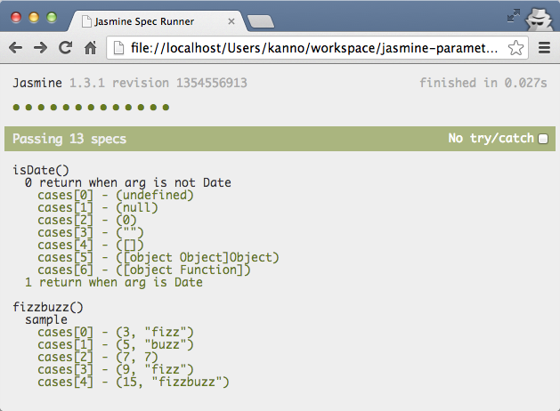

jasmine-parameterize - jasmine plugin for parameterized test
===========================================================



## Download

* [jasmine-parameterize.js](https://raw.github.com/kannokanno/jasmine-parameterize/master/jasmine-parameterize.js)

## Usage

The list of parameters is passed to `cases()`.

The value specified by `cases()` is passed to the argument of `function` of `it` for every test.

### Single element

If single value, it can write by a one-dimensional array.

```javascript
describe('isDate()', function() {
  cases([undefined, null, 0, '', [], {}, function(){}])
  .it('0 return when arg is not Date', function(param) {
    expect(isDate(param)).toEqual(0);
  });
});
```

### Multiple element

If multiple value, it can write by two-dimensional array.

```javascript
describe('fizzbuzz()', function() {
  cases([
    [3, 'fizz'],
    [5, 'buzz'],
    [7, 7],
    [9, 'fizz'],
    [15, 'fizzbuzz'],
  ])
  .it('sample', function(n, expected) {
    expect(fizzbuzz(n)).toEqual(expected);
  });
});
```

## License

This software is released under the MIT License, see LICENSE.txt.
